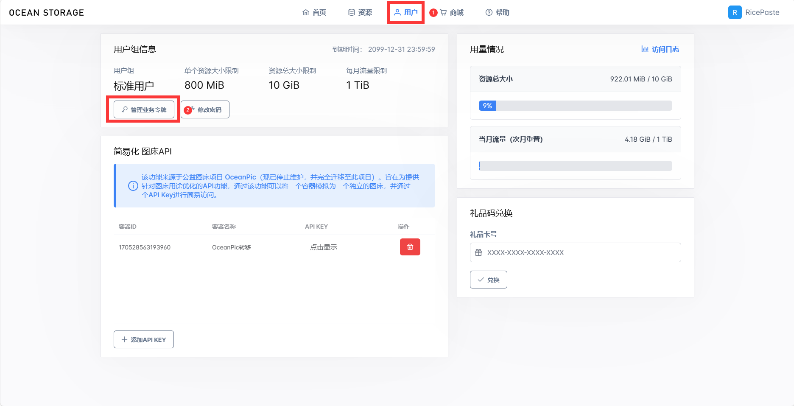
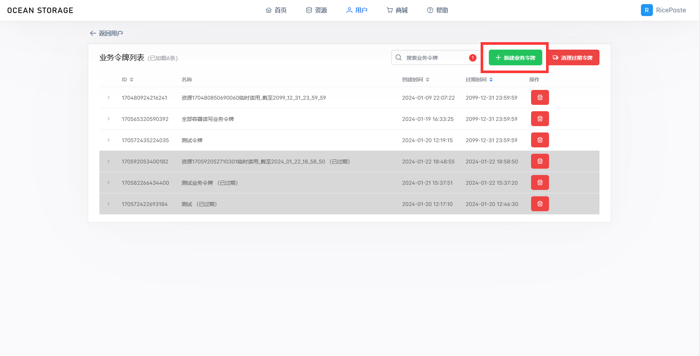

# 快速接入
?> OceanStorage 提供了一套自创的基于 **业务令牌** 的开放API，你可以通过这套开放API实现对容器和资源的管理。

## 重要概念
这一部分将快速向您介绍 OceanStorage 独特的资源管理体系，使您能快速上手本系统。
### 容器（container）与资源（resources）
在 OceanStorage 中，每个被托管的文件被称为一个资源，而容器则是资源的集合。我们建议将相关的资源放置在同一个容器中，以便进行更细致的管理。容器和资源在系统中被统称为“对象”。

容器具有默认的读写权限（从低到高分别为**私有、公共读、公共读写**），而业务令牌可以提升访问者的读写权限。在默认权限下，不提供鉴权信息也可以按如下表格访问开放API。

|                                                       | 私有        | 公共读          | 公共读写     |
| -------------                                         | --------   | -------         | --------     |
| 下载资源（download/get）                                | ×          | √              | √            |
| 上传资源（upload）                                      | ×           | ×             | √            |

### 业务令牌
业务令牌是用来访问 开放API 的身份验证方式，您可以创建账户级别或对象级别的业务令牌，并细粒度地管理访问范围、读写权限等。

## 创建一个业务令牌
**业务令牌**是访问开放API时提升权限等级的唯一途径，在用户->用户组信息->管理业务令牌中，点击“新建业务令牌”按钮，即可在弹窗中创建一个业务令牌。


业务令牌总体被划分为**“账户级”**和**“对象级”**两类。

?> **提升权限** 是指在原本的默认权限基础上进行提升。举个例子，如果原本容器的默认读写权限为公共读写，那么即使使用读写权限为“只读”的业务令牌，仍然可以不受阻拦地访问上传资源接口。

### 账户级业务令牌
账户级的业务令牌可以提供针对整个账户下所有对象（包括容器和资源）的特定权限。在访问范围上分为容器级和资源级，在读写权限上划分为只读和可读写。通过下表你可以了解不同的账户级业务令牌所拥有的权限提升能力：

|                                                       | 容器级-只读 | 容器级-可读写    | 资源级-只读   | 资源级-可读写 |
| -------------                                         | --------   | -------    | --------        | -----------  |
| 下载资源（download/get）                                | √          | √              | √            | √            |
| 上传资源（upload）                                      | ×           | √             | ×            | √            |
|| 
| 获取所有容器（getContainers）                           | √          | √               | ×            | ×           |
| 通过ID获取容器信息（getContainerInfoById）              | √           | √              | ×            | ×            |
| 通过容器ID获取所有资源（getResourcesByContainerId）      | √          | √              | ×            | ×            |
| 创建新容器（createNewContainer）                        | ×          | √              | ×            | ×            |
| 修改容器信息（editContainerInfo）                       | ×           | √             | ×            | ×            |
| 重命名资源（rename）                                    | ×           | √             | ×            | ×            |
| 删除资源（delete）                                      | ×           | √             | ×            | ×            |
|| 
| 删除容器（此接口不属于开放API的部分）   | ×           | ×             | ×            | ×            |

#### 含义解读与最佳实践
由上表，容器级权限所拥有的权限比资源级要多得多，并且可以注意到的是某些权限和字面上的含义似乎不同，这是考虑到实践过程中的具体需求定制的。

容器级业务令牌不仅拥有容器相关的权限，还同时拥有了其下资源的删除、重命名权限，推荐**使用在服务端**。而资源级业务令牌仅提供了纯粹的资源读写权限，除此之外不再提供任何能力，可以放心地**直接在客户端硬编码**，而无需过多担心业务令牌泄露或被破解造成的风险。

### 对象级业务令牌
对象级的业务令牌可以提供针对指定对象的特定权限，这个对象既可以是容器也可以是资源。在访问范围上同样分为容器级和资源级，在读写权限上划分为只读和可读写。这种业务令牌可以提供更加细粒度的权限管理。

同时，一个对象级业务令牌可以**同时拥有多个对象的提升权限**。

#### 针对容器的对象级业务令牌
通过下表你可以了解不同的针对容器的对象级业务令牌所拥有的权限提升能力：

|                                                       | 容器级-只读 | 容器级-可读写    | 资源级-只读   | 资源级-可读写 |
| -------------                                          | --------   | -------        | --------      | -----------  |
| 下载资源（download/get）                                | √          | √              | √              | √            |
| 上传资源（upload）                                      | ×           | √             | ×            | √            |
||
| 获取所有可访问的容器（getContainers）                     | √          | √              | ×            | ×           |
| 通过ID获取可访问的容器信息（getContainerInfoById）        | √           | √              | ×            | ×            |
| 通过容器ID获取所有可访问的资源（getResourcesByContainerId）| √          | √              | ×            | ×            |
| 重命名资源（rename）                                    | ×           | √             | ×            | ×            |
| 删除资源（delete）                                      | ×           | √             | ×            | ×            |
|| 
| 创建新容器（createNewContainer）                        | ×          | ×              | ×            | ×            |
| 修改容器信息（editContainerInfo）                       | ×           | ×             | ×            | ×            |
||
| 删除容器（此接口不属于开放API的部分）                    | ×           | ×             | ×            | ×            |

#### 针对资源的对象级业务令牌
通过下表你可以了解不同的针对资源的对象级业务令牌所拥有的权限提升能力：

|                                                       | 容器级-只读 | 容器级-可读写    | 资源级-只读   | 资源级-可读写 |
| -------------                                          | --------   | -------        | --------      | -----------  |
| 下载资源（download/get）                                | √          | √              | √              | √            |
| 上传资源（upload）                                      | ×           | √             | ×            | √            |
||
| 获取所有可访问的容器（getContainers）                     | ×          | ×              | ×            | ×           |
| 通过ID获取可访问的容器信息（getContainerInfoById）        | ×           | ×              | ×            | ×            |
| 通过容器ID获取所有可访问的资源（getResourcesByContainerId）| √          | √              | ×            | ×            |
| 重命名资源（rename）                                    | ×           | √             | ×            | ×            |
| 删除资源（delete）                                      | ×           | √             | ×            | ×            |
|| 
| 创建新容器（createNewContainer）                        | ×          | ×              | ×            | ×            |
| 修改容器信息（editContainerInfo）                       | ×           | ×             | ×            | ×            |
||
| 删除容器（此接口不属于开放API的部分）                    | ×           | ×             | ×            | ×            |

#### 含义解读与最佳实践
由上表，容器级权限所拥有的权限比资源级要多得多，并且可以注意到的是某些权限和字面上的含义似乎不同，这是考虑到实践过程中的具体需求定制的。

容器级业务令牌不仅拥有容器相关的权限，还同时拥有了其下资源的删除、重命名权限，推荐**使用在服务端**。而资源级业务令牌仅提供了纯粹的资源读写权限，除此之外不再提供任何能力，可以放心地**直接在客户端硬编码**，而无需过多担心业务令牌泄露或被破解造成的风险。

## 使用业务令牌

在请求接口时，你需要将 业务令牌 添加到请求头（推荐）或请求参数中，以便我们识别你的身份。

以 JavaScript 的 Axios 库为例，下面两种用法都是被允许的：

用法1：

```javascript
var axios = require('axios');
var FormData = require('form-data');
var data = new FormData();
​
var config = {
  method: 'get/post',
  url: 'http://storage.codesocean.top/api/...',
  headers: { 
    'ServiceKey': '（你的业务令牌）', 
    ...data.getHeaders()
  },
  data : data
};
​
axios(config)
.then(function (response) {
  console.log(JSON.stringify(response.data));
})
.catch(function (error) {
  console.log(error);
});
```

用法2：

```javascript
var axios = require('axios');
var FormData = require('form-data');
var data = new FormData();
​
var config = {
  method: 'get/post',
  url: 'http://storage.codesocean.top/api/...?ServiceKey=' + '（你的业务令牌）',
  data : data
};
​
axios(config)
.then(function (response) {
  console.log(JSON.stringify(response.data));
})
.catch(function (error) {
  console.log(error);
});
```